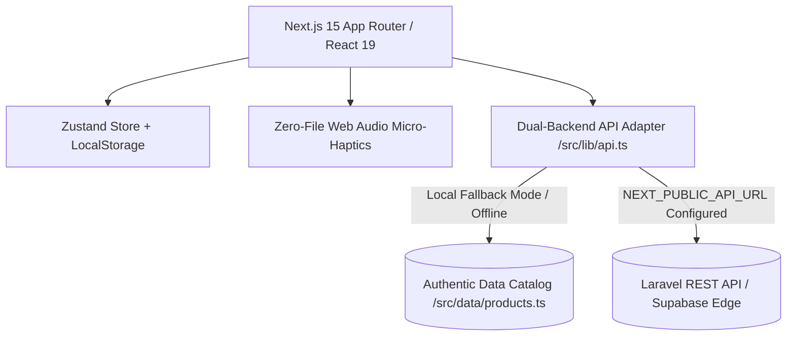

# MITAVIN LUXURY HEALTHCARE REDESIGN — ARCHITECTURE LEDGER (LOG.md)

**Project Identifier:** Mitavin Luxury Longevity & Genuine Healthcare E-Commerce  
**Design Archetype:** Archetype A: Editorial Organic Health (GroundAI / Aesop Standard)  
**Lead Creative Engineer:** Antigravity Chief Architect  
**Initial Architecture Release Date:** September 2026  
**Status:** Phase 1 (The Foundational Bedrock) Completed & Verified  

---

## 1. Architectural Overview & System Design

Mitavin is redesigned from first principles to address Bangladesh's acute counterfeit pharmaceutical and infant nutrition crisis. The technical architecture prioritizes zero-friction client-side performance, deterministic data resilience, and immediate out-of-the-box operation with a decoupled dual-backend bridge.

---

## 2. OKLCH Design Token System & Formula Reference

Colors are mapped strictly using the **OKLCH** (Lightness, Chroma, Hue) color space for perceptual uniformity across high-gamut mobile and desktop displays.

| Token Name | OKLCH Formula | Hex / Visual Analogue | Semantic Intent |
|---|---|---|---|
| `--bg-canvas` | `oklch(0.985 0.006 85)` | `#FAF9F5` Warm Travertine | Calming, clinical organic paper substrate |
| `--bg-card` | `oklch(1.0 0 0)` | `#FFFFFF` Pure White | Clean dispensary tile elevation |
| `--border-whisper` | `oklch(0.92 0.008 85)` | Subtle warm hairline | Hairline card boundary without visual weight |
| `--border-subtle` | `oklch(0.88 0.012 85)` | Muted gray-stone | Focus and active boundary |
| `--ink-primary` | `oklch(0.18 0.02 240)` | `#1c242e` Deep Slate | Editorial typography with deep contrast |
| `--ink-muted` | `oklch(0.48 0.015 240)` | Subdued Charcoal | Secondary descriptions and metadata |
| `--brand-emerald` | `oklch(0.64 0.18 155)` | Clinical Emerald Green | Authenticity seal, medical trust, positive CTAs |
| `--brand-champagne` | `oklch(0.82 0.12 85)` | Authentic Seal Gold | Origin verification seals, star ratings |
| `--scarcity-crimson`| `oklch(0.62 0.22 25)` | Pure Clinical Crimson | Low-stock urgency and cart item removals |

### Master Z-Index Hierarchy (Directive 5)
- `z-canvas` (`z-0`): Canvas & decorative backgrounds.
- `z-content` (`z-10`): Interactive cards, grids, and hero typography.
- `z-nav` (`z-30`): Sticky glass navigation header.
- `z-grain` (`z-40`): SVG fractal noise film grain (`pointer-events: none`).
- `z-cursor` (`z-50`): Trailing cursor canvas.
- `z-modal` (`z-60`): Slide-over cart drawer and Quick-View modal dialogs.

---

## 3. Zero-File Web Audio Micro-Haptics Engine (`src/lib/sound.ts`)

To eliminate network latency and asset footprint, the sound engine synthesizes all haptics procedurally via the browser's Web Audio API using a lazy singleton `AudioContext`.

1. **`playHapticClick(vol = 0.08)`**: 8ms triangle wave frequency drop (`1200Hz -> 80Hz`) mimicking a crisp mechanical tactile switch.
2. **`playHapticPop(vol = 0.12)`**: 18ms upward sine wave pitch sweep (`320Hz -> 880Hz`) for Add-to-Cart confirmations.
3. **`playHapticGlass(vol = 0.06)`**: 25ms resonant pure tone at `2400Hz` for drawer slide-overs and tabs.
4. **`playHapticSuccess(vol = 0.15)`**: Harmonic dual-oscillator major chime (`E6 = 1318.5Hz` + `G#6 = 1661.2Hz`) with smooth exponential decay for checkout completions.
5. **`playHapticSwoosh(vol = 0.07)`**: 50ms filtered ascending sweep for view transitions.
6. **Mute Synchronization**: Persisted to `localStorage` key `mitavin_sound_muted` and synced bidirectionally with the Zustand store.

---

## 4. State Management Architecture (`src/lib/store.ts`)

Built using Zustand 5 with the `persist` middleware configured for `localStorage`:

- **Cart State**: `items: CartItem[]` with optimistic quantity modification, safe boundary checks, and batch stock limits.
- **Dynamic Delivery Calculator**:
  - Threshold constant: `৳2,000` (Dhaka Metro Free Delivery).
  - `getFreeDeliveryRemaining()`: Returns `Math.max(0, 2000 - subtotal)`.
  - `getFreeDeliveryProgress()`: Percentage progress calculation for dynamic UI status bars.
- **Transient UI State**: `isCartOpen`, `isSearchOpen`, `isQuickViewOpen`, and `activeQuickViewProduct` are decoupled from local storage to prevent sticky modals on cold refresh.

---

## 5. Authentic Product Catalog (`src/data/products.ts`)

Includes 18 SKUs mapped directly from real Mitavin inventory:
- **Mother & Baby**: Aveeno Baby Daily Moisture Wash & Lotion, Aptamil Gold+ Stages 1, 2, and 3, Similac 3-HMO Gold Stage 3.
- **Senior Care & Incontinence**: Giggles Adult Diapers Extra Soft Large (30s) and Giggles Pull-Up Pants Medium.
- **Vitamins & Longevity**: Vitabiotics Pregnacare Plus Omega-3, Wellman Original, Wellwoman 70+.
- **Dermatological Skincare**: Kirkland Signature Minoxidil 5%, CeraVe Hydrating Mineral Sunscreen SPF 50, CeraVe Resurfacing Retinol Serum.
- **OTC & Daily Healthcare**: Panadol Advance 500mg (GSK UK Optizorb), Sambucol Black Elderberry Liquid.
- **Clinical Diagnostics**: VivaChek Ino Blood Glucose Test Strips (50s) and Complete Starter Kit.

---

## 6. Decoupled Dual-Backend Adapter (`src/lib/api.ts`)

The adapter abstracts all data queries:
- Automatically reads `process.env.NEXT_PUBLIC_API_URL`.
- If set: Dispatches standard REST calls to `/api/products`, `/api/products/:id`, and `/api/orders`.
- If unset (or during offline development): Operates against local authentic data with simulated 100ms async latency.
- Signature contracts:
  - `getProducts(category?: string, search?: string): Promise<Product[]>`
  - `getProductById(id: string): Promise<Product | null>`
  - `getProductBySlug(slug: string): Promise<Product | null>`
  - `submitOrder(orderData: OrderPayload): Promise<OrderResponse>`

---

## 7. Changelog

- **v0.1.0-alpha (Phase 1 Foundational Bedrock)**:
  - Initialized Next.js 15 App Router with React 19 and Tailwind CSS.
  - Implemented OKLCH color token system and subtle SVG fractal film grain in `src/app/globals.css`.
  - Synthesized zero-file Web Audio micro-haptics in `src/lib/sound.ts`.
  - Built persistent type-safe cart and UI state store in `src/lib/store.ts`.
  - Documented 18 authentic verified SKUs with clinical specs in `src/data/products.ts`.
  - Implemented dual-backend API layer in `src/lib/api.ts`.
  - Sourced verified high-resolution photography in `src/lib/media.ts` and editorial copy in `src/lib/copy.ts`.
  - Verified compilation with Next.js 15 and TypeScript.
